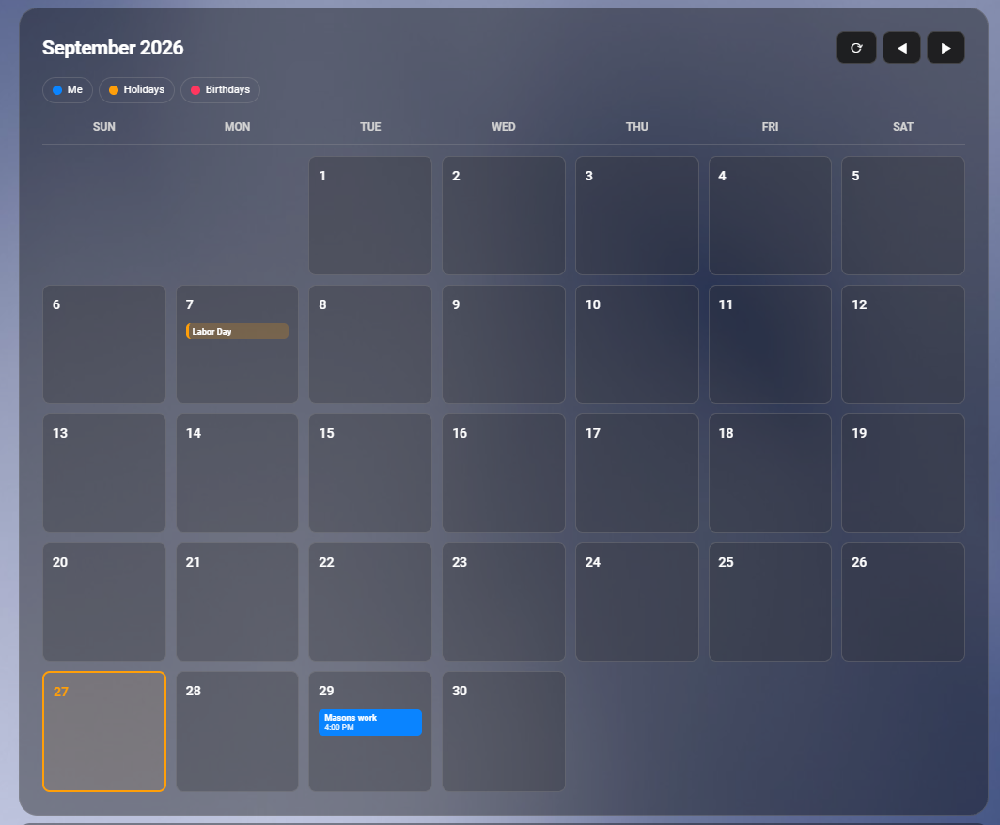

# Interactive Calendar Card

A month-view calendar card for [Home Assistant](https://www.home-assistant.io/) that lets you **add, view, edit and delete events** right from your dashboard. It works great with Google Calendar and can show several calendars at once, each with its own color.

It's a single JavaScript file. No helpers, scripts, template sensors or `browser_mod` needed.

   

## Features

- **Month view** with previous/next month buttons and today highlighted.
- **Add events:** tap an empty part of any day.
- **Event details:** tap an event to see its time, calendar, address (with a Google Maps link), whether it repeats, and its notes.
- **Edit and delete** events on your main calendar. Delete asks for a second tap, so a mis-tap can't remove an event.
- **All-day and multi-day events,** shown on every day they cover.
- **Multiple calendars** (holidays, birthdays, family, work…) with color-coded event badges and three badge styles.
- **Legend** that lets you tap a calendar to show or hide it. The choice is remembered per browser.
- **Sync button** plus automatic sync, so changes made in Google show up quickly.
- **Follows your Home Assistant theme** in light and dark mode.

## Requirements

- Home Assistant with at least one calendar entity (`calendar.*`).
- To add, edit or delete events, the calendar has to allow it. For **Google Calendar**, the integration must be set up with **read/write** access. If you chose read-only when adding it, remove the integration and add it again with read/write.
- Calendars that don't allow changes (for example Google's holiday calendars) can still be shown. Their events just open as read-only.

## Installation

### Option 1: HACS (custom repository)

1. In Home Assistant, open **HACS**.
2. Open the ⋮ menu (top right) and choose **Custom repositories**.
3. Paste this repository's URL, `https://github.com/KragHorn/interactive-calendar-card`, choose the **Dashboard** type (called **Lovelace** or **Plugin** in older HACS versions), and click **Add**.
4. Find **Interactive Calendar Card** in HACS and click **Download**.
5. Reload your browser when HACS asks you to.

HACS adds the dashboard resource for you.

### Option 2: Manual

1. Download `interactive-calendar-card.js` from this repository.
2. Copy it into your Home Assistant `config/www/` folder. You can use the File editor or Studio Code Server add-on, Samba, or SSH. Create the `www` folder if it doesn't exist; if you just created it, restart Home Assistant once.
3. Go to **Settings → Dashboards**, open the ⋮ menu (top right) and choose **Resources**. If you don't see Resources, turn on **Advanced mode** in your user profile first.
4. Click **Add resource** and enter:
   - **URL:** `/local/interactive-calendar-card.js?v=1`
   - **Resource type:** `JavaScript module`
5. Hard-refresh your browser (**Ctrl+Shift+R**, or **Cmd+Shift+R** on a Mac). In the mobile app, go to **Settings → Companion app → Debugging → Reset frontend cache**.

**Updating a manual install:** replace the file, then edit the resource and bump the number at the end (`?v=2`, `?v=3`, …). Browsers cache custom cards heavily, and the new number makes them load the new version.

## Adding the card

Open your dashboard, click **Edit dashboard → Add card**, scroll down and choose **Manual**, then paste:

```yaml
type: custom:interactive-calendar-card
entities:
  - calendar.your_calendar
```

To find your calendar's entity ID, go to **Settings → Devices & services → Entities** and search for `calendar.`.

The card is configured in YAML. There's no visual editor.

## Full example

```yaml
type: custom:interactive-calendar-card
title: Family Calendar
first_day: monday
time_format: 12h
max_width: 1100px
day_height: 110
event_font_size: 0.7rem
today_color: "#30d158"
default_start_time: "09:00"
default_duration: 60
entities:
  - entity: calendar.me_gmail_com
    name: Me
    color: "#0a84ff"
    primary: true
  - entity: calendar.holidays_in_united_states
    name: Holidays
    color: "#ff9f0a"
    style: soft
  - entity: calendar.birthdays
    name: Birthdays
    color: "#ff375f"
    style: outline
```

## Options

### Calendars (`entities`)

`entities` is required. It can be a single entity ID, a list of entity IDs, or a list of calendar settings like the full example above. You can mix the forms.

```yaml
# Simplest
entities: calendar.me_gmail_com

# List of IDs (colors are picked automatically)
entities:
  - calendar.me_gmail_com
  - calendar.holidays_in_united_states
```

Settings for each calendar:

| Option | Default | What it does |
|---|---|---|
| `entity` | *(required)* | The calendar's entity ID, e.g. `calendar.me_gmail_com`. |
| `name` | Entity's friendly name | Name shown in the legend and in event details. |
| `color` | From a built-in palette | Color of this calendar's event badges and legend dot. Any CSS color works: `"#ff9f0a"`, `orange`, `"rgb(255,159,10)"`, or a theme variable like `var(--primary-color)`. Put hex colors in quotes. |
| `style` | `solid` for the primary calendar, `soft` for the others | How the badges look. See [Badge styles](#badge-styles). |
| `primary` | The first calendar in the list | The calendar new events are added to, and the only one whose events can be edited or deleted. Set `primary: true` on one calendar. |

#### Badge styles

| Style | Look | Good for |
|---|---|---|
| `solid` | Filled with the calendar color. The text turns black or white automatically so it stays readable (this works with hex colors like `"#ffd60a"`; other color formats get white text). | Your main calendar |
| `soft` | Light tint of the color with a colored bar on the left edge. | Holidays, shared calendars |
| `outline` | Transparent with a colored border. | Birthdays, reminders |

### Text and behavior

| Option | Default | What it does |
|---|---|---|
| `title` | *(none)* | Small heading shown above the month name, e.g. `Family Calendar`. |
| `first_day` | `sunday` | First day of the week: `sunday` or `monday`. |
| `time_format` | `12h` | `12h` (2:30 PM) or `24h` (14:30). Used on badges and in event details. |
| `default_start_time` | `"09:00"` | Start time filled in when you tap an empty day to add an event. Use 24-hour format in quotes. |
| `default_duration` | `60` | Length of new events in minutes. |
| `show_legend` | `true` when there's more than one calendar | Show the row of calendar names you can tap to show or hide each calendar. |
| `show_sync_button` | `true` | Show the ⟳ sync button in the header. |
| `auto_sync_minutes` | `5` | How often the card asks Home Assistant to re-sync with Google while the dashboard is open. `0` turns automatic sync off. |
| `hide_titles` | *(none)* | List of event titles to hide (not case-sensitive), e.g. `[Canceled, "Out of office"]`. |

### Size and colors

For sizes, a plain number means pixels (`day_height: 90` is `90px`). You can also use any CSS unit in quotes, like `"6rem"` or `"90%"`.

| Option | Default | What it does |
|---|---|---|
| `max_width` | *(none, fills the column)* | Maximum width of the card. It's centered if the space is wider. See [Width and height](#width-and-height). |
| `day_height` | `105px` | **Minimum** height of each day box. A day with many events still grows to fit them. Smaller values make the whole card shorter. |
| `day_gap` | `10px` | Space between day boxes. |
| `card_padding` | `24px` | Space between the card's edge and the calendar. |
| `header_font_size` | `1.5rem` | Size of the month and year heading. |
| `day_number_font_size` | `1rem` | Size of the day numbers. |
| `event_font_size` | `0.66rem` | Size of the text in event badges. The time line under each title scales with it. |
| `event_radius` | `5px` | Corner roundness of event badges. `0` gives square corners, `999px` gives pill shapes. |
| `today_color` | Theme accent color | Color of today's border and day number. Any CSS color. |

Everything else (card background, text colors, borders, the popup and its buttons) follows your Home Assistant theme automatically.

#### Width and height

The card is as wide as the space the dashboard gives it:

- **Masonry view** (the classic default): the card fills one column. For a big calendar, use a **Panel** view (one card filling the whole screen) or a **Sections** view.
- **Sections view:** edit the card, open the **Layout** tab and drag it wider, up to the full section width.
- **`max_width`** stops it from getting too wide on large screens, e.g. `max_width: 1100px`.

Height comes from the day boxes: six weeks of `day_height` plus the header. Lower `day_height` for a more compact card. On a phone, `day_height: 70` with `event_font_size: 0.6rem` works well.

#### Setting options in a theme

The size and color options are also CSS variables, so you can set them for every calendar card at once in a [theme](https://www.home-assistant.io/integrations/frontend/#defining-themes), without the leading `--`:

```yaml
my_theme:
  icc-day-height: 90px
  icc-event-font-size: 0.7rem
  icc-today-color: "#30d158"
```

Available variables: `icc-max-width`, `icc-day-height`, `icc-gap`, `icc-card-padding`, `icc-header-font-size`, `icc-day-number-size`, `icc-event-font-size`, `icc-event-radius`, `icc-today-color`. Options set on a card override the theme.

## Using the card

| To… | Do this |
|---|---|
| Add an event | Tap an empty part of a day. Fill in the title, times (or tick **All day**), and optionally an address and notes, then tap **Save**. |
| See an event's details | Tap the event. |
| Edit an event | Tap the event, then **Edit**. Change what you need and tap **Save**. **Cancel** takes you back to the details. |
| Delete an event | Tap the event, then **Delete**, then **Tap again to delete**. |
| Change month | Use ◀ and ▶. |
| Show or hide a calendar | Tap its name in the legend. |
| Pull in changes made elsewhere | Tap ⟳. |
| Close the popup | Tap **Close**, tap outside the popup, or press **Esc**. |

## How it works

- Events are read from Home Assistant's calendar API. They're added, edited and deleted with Home Assistant's built-in calendar commands, the same ones the Calendar page in the sidebar uses. This is why no helpers or scripts are needed.
- **Google Calendar can't change an event in place** through Home Assistant, so saving an edit creates the updated event and then deletes the old one. Calendars that do support in-place editing (such as Home Assistant's Local Calendar) are updated directly.
- Editing or deleting one event from a **recurring series** only changes that one occurrence.
- Home Assistant keeps its own copy of your Google calendars and normally refreshes it about every 15 minutes. The card forces a refresh when the dashboard opens, every few minutes while it's open (`auto_sync_minutes`), after every save or delete, and whenever you tap ⟳.

## Troubleshooting

**"Custom element doesn't exist: interactive-calendar-card"**
The file isn't loaded. Check that the resource exists under **Settings → Dashboards → Resources**, that its URL matches where the file is (`/local/…` means `config/www/…`), and that the type is **JavaScript module**. Then hard-refresh. The name after `custom:` must be exactly `interactive-calendar-card`.

**Changes to the file don't show up**
Your browser is still using the cached old version. Bump the `?v=` number on the resource and hard-refresh. In the mobile app, reset the frontend cache.

**Saving or deleting fails with a permissions or "not supported" error**
The calendar is read-only. For Google Calendar, re-add the integration with **read/write** access.

**Delete fails with "Event does not exist … or malformed"**
Home Assistant's copy of the calendar is out of date. Tap ⟳ and try again. If that doesn't help, go to **Settings → Devices & services → Google Calendar → ⋮ → Reload**.

**Events added on my phone don't appear**
Tap ⟳. If they still don't appear after a minute, check that the calendar entity shows the event on the **Calendar** page in the Home Assistant sidebar. If it's missing there too, the problem is the Google integration, not the card.

**I can't edit holiday or birthday events**
That's expected. Only the `primary` calendar can be edited, and Google doesn't allow changes to subscribed calendars like holidays anyway.

**Formatting in event notes disappeared**
Notes are shown and edited as plain text. Bold text, links and other formatting from Google aren't kept when you save an edit.

For anything else, open your browser's developer console (F12). The card logs its errors there, and they're useful to include when opening an issue.

## Limitations

- YAML configuration only (no visual card editor).
- New events are always added to the one `primary` calendar.
- Event notes are plain text.

## License

See [LICENSE](LICENSE).
